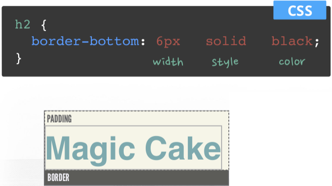

# Introdução a HTML + CSS

# Começando

* [receitas.docx](receitas.docx)

* [receitas.md](receitas.md)

```
# Grandes Receitas

* Home
* Receitas
* Sugestões

  **Fonte:** [tudogostoso.com.br](http://www.tudogostoso.com.br/receita/23-bolo-de-cenoura.html)

## Bolo de cenoura

### Ingredientes

* 1/2 xícara (chá) de óleo
* 3 cenouras médias raladas
* 4 ovos
* 2 xícaras (chá) de açúcar
* 2 e 1/2 xícaras (chá) de farinha de trigo
* 1 colher (sopa) de fermento em pó

### Modo de preparo

1. Em um liquidificador, adicione a cenoura, os ovos e o óleo, depois misture
2. Acrescente o açúcar e bata novamente por 5 minutos
3. Em uma tigela ou na batedeira, adicione a farinha de trigo e depois misture novamente
4. Acrescente o fermento e misture lentamente com uma colher
5. Asse em um forno preaquecido a 180° C por aproximadamente 40 minutos

### Informações Adicionais

Se o seu liquidificador for potente, o bolo todo pode ser feito nele. Você poderá seguir ao vídeo ou a receita escrita, o resultado sairá perfeito dos 2 modos. Utilize cerca de 250 g de cenoura para o bolo não solar. Se desejar uma cobertura mais leve, adicione 5 colheres de leite.
```


# HTML

HyperText Markup Language

#### HyperText

Superando as restrições do texto escrito. Interativo.

#### Markup Language

Uma maneira de literalmente "marcar" um documento para especificar atributos, como
diferentes tamanhos de fontes, listas, links para outras páginas e imagens.


## Corpo do HTML

```
<!DOCTYPE html>
<html lang="en">

<head>
  <meta charset="UTF-8">
  <title>Título</title>
</head>

<body>
  <div>
    <h1>Grandes Receitas</h1>
    <p>Como preparar um bolo de cenoura saboroso.</p>
  </div>
</body>

</html>
```


## Grandes Receitas

```html
<h1>Grandes Receitas</h1>
```

Abre tag, fecha tag.

```html
<h1>Grandes Receitas</h1>
<h2>Bolo de cenoura</h2>
<h3>Ingredientes</h3>
<h4>Subsessão nível 4</h4>
<h5>Subsessão nível 5</h5>
<h6>Subsessão nível 6</h6>
```

### Listas

#### Não ordenada

```html
  <h3>Ingredientes</h3>

  <ul>
    <li>1/2 xícara (chá) de óleo</li>
    <li>3 cenouras médias raladas</li>
    <li>4 ovos</li>
    <li>2 xícaras (chá) de açúcar</li>
    <li>2 e 1/2 xícaras (chá) de farinha de trigo</li>
    <li>1 colher (sopa) de fermento em pó</li>
  </ul>
```

`ul` é *parent* (pai) e `li` é *children* (filho).

#### Ordenada

```html
  <h3>Modo de preparo</h3>

  <ol>
    <li>Em um liquidificador, adicione a cenoura, os ovos e o óleo, depois misture</li>
    <li>Acrescente o açúcar e bata novamente por 5 minutos</li>
    <li>Em uma tigela ou na batedeira, adicione a farinha de trigo e depois misture novamente</li>
    <li>Acrescente o fermento e misture lentamente com uma colher</li>
    <li>Asse em um forno preaquecido a 180° C por aproximadamente 40 minutos</li>
  </ol>
```


### Link

```html
<a href="" target="_blank">texto</a>

<a href="http://www.tudogostoso.com.br/receita/23-bolo-de-cenoura.html" target="_blank">tudogostoso.com.br</a>
```

#### Exemplo

```html
<!-- index.html -->
<!DOCTYPE html>
<html lang="en">
<head>
  <meta charset="UTF-8">
  <title>Bolo de cenoura</title>
</head>
<body>
  <h1>Grandes Receitas</h1>

  <ul>
    <li><a href="home.html">Home</a></li>
    <li><a href="receitas.html">Receitas</a></li>
    <li><a href="sugestoes.html">Sugestões</a></li>
  </ul>

  <p><b>Fonte:</b> <a href="http://www.tudogostoso.com.br/receita/23-bolo-de-cenoura.html" target="_blank">tudogostoso.com.br</a></p>

  <h2>Bolo de cenoura</h2>

  <h3>Ingredientes</h3>

  <ul>
    <li>1/2 xícara (chá) de óleo</li>
    <li>3 cenouras médias raladas</li>
    <li>4 ovos</li>
    <li>2 xícaras (chá) de açúcar</li>
    <li>2 e 1/2 xícaras (chá) de farinha de trigo</li>
    <li>1 colher (sopa) de fermento em pó</li>
  </ul>

  <h3>Modo de preparo</h3>

  <ol>
    <li>Em um liquidificador, adicione a cenoura, os ovos e o óleo, depois misture</li>
    <li>Acrescente o açúcar e bata novamente por 5 minutos</li>
    <li>Em uma tigela ou na batedeira, adicione a farinha de trigo e depois misture novamente</li>
    <li>Acrescente o fermento e misture lentamente com uma colher</li>
    <li>Asse em um forno preaquecido a 180° C por aproximadamente 40 minutos</li>
  </ol>

  <h3>Informações Adicionais</h3>

  <p>Se o seu liquidificador for potente, o bolo todo pode ser feito nele. Você poderá seguir ao vídeo ou a receita escrita, o resultado sairá perfeito dos 2 modos. Utilize cerca de 250 g de cenoura para o bolo não solar. Se desejar uma cobertura mais leve, adicione 5 colheres de leite.</p>
</body>
</html>
```

## Imagens

#### Jeito errado

```html
</img>
```

#### Jeito certo

```html

```

**Sintaxe:**

```html

```

#### Exemplo

```html
<h3>Fotos</h3>

<ul class="photos">
  <li></li>
  <li></li>
  <li></li>
</ul>
```


## Tabelas

```
<table border="1">

  <thead>
    <tr>
      <th>Marca</th>
      <th>Modelo</th>
      <th>Ano</th>
    </tr>
  </thead>

  <tbdy>
    <tr>
      <td>Honda</td>
      <td>Civic</td>
      <td>2020</td>
    </tr>
    <tr>
      <td>Volkswagen</td>
      <td>Gol</td>
      <td>2019</td>
    </tr>
    <tr>
      <td>Fiat</td>
      <td>Palio</td>
      <td>2020</td>
    </tr>
    <tr>
      <td>Renault</td>
      <td>Logan</td>
      <td>2020</td>
    </tr>
  </tbdy>

  <tfooter>
    <tr>
      <td>Última atualização 02/2020.</td>
    </tr>
  </tfooter>

</table>
```


# CSS

#### Jeito errado

```html
<H3 COLOR=RED><CENTER>Ingredientes</CENTER></H3>
```

#### Jeito certo

```html
<h3 style="color=red;">Ingredientes</h3>
```

#### Exemplo

```html
<!-- index2.html -->
<style type="text/css">
p {
  text-decoration: underline;
  color: red;
}
</style>
```

**Sintaxe:**

```css
seletor {
  propriedade: valor;
}
```

#### CSS nas listas

```css
li {
  font-size: 24px;
}
```

```css
ul li {
  font-size: 24px;
}
```

#### Selecionando tags baseado em ações e condições

```css
a {
  text-decoration: none;
}
a:hover {
  text-decoration: underline;
  color: darkred;
}
```

#### Usando pseudo-seletor

```css
ol li:first-child {
  color: red;
}
```

#### Menu em inline-level

```css
ul li {
  display: inline;
}
```

### Uso de classes

```html
<ul class="nav">
  <li><a href="home.html">Home</a></li>
  <li><a href="receitas.html">Receitas</a></li>
  <li><a href="sugestoes.html">Sugestões</a></li>
</ul>
```

```css
.nav {
  padding-left: 0;
}
.nav li {
  display: inline;
}
```


### Espaçamento


### Borda


### Borda inferior



### Margem


#### Exemplo

Abra `index3.html`

Crie um arquivo chamado `static/css/main.css`

```css
h2 {
  padding: 10px 0 10px 0;
  margin: 20px 0 20px 0;
}
```

### Exercício - Resetando o estilo padrão

Abra `index4.html`

```html
<link type="text/css" rel="stylesheet" href="static/css/main2.css">
```

Crie um arquivo chamado `static/css/main2.css`

```css
html, body, h1, h2, h3, p, ol, ul, li, a {
  padding: 0;
  border: 0;
  margin: 0;
}
body {
  padding: 20px 20px 20px 20px;
}
h1 {
  margin: 10px 0 15px 0;
}
h2 {
  margin: 10px 0 20px 0;
}
h3 {
  margin: 15px 0 15px 0;
  border-bottom: 1px solid #cccccc;
  padding-bottom: 3px;
}
ul {
  padding: 0 0 0 50px;
}
ul li {
  font-size: 24px;
  /*display: inline;*/
}
ol {
  padding: 0 0 0 50px;
}
.nav {
  padding-left: 0;
}
.nav a {
  color: #000af;
}
.nav li {
  display: inline;
}
```

### Exercício - Lista de Receitas

```html
<!-- receitas.html -->
<!DOCTYPE html>
<html lang="en">
<head>
  <meta charset="UTF-8">
  <title>Bolo de cenoura</title>

  <link type="text/css" rel="stylesheet" href="static/css/receitas.css">
</head>
<body>
  <h1>Grandes Receitas</h1>

  <ul class="nav">
    <li><a href="home.html">Home</a></li>
    <li><a href="receitas.html">Receitas</a></li>
    <li><a href="sugestoes.html">Sugestões</a></li>
  </ul>

  <p><b>Fonte:</b> <a href="http://www.tudogostoso.com.br/receita/23-bolo-de-cenoura.html" target="_blank">tudogostoso.com.br</a></p>

  <h2>Receitas</h2>
  <ul class="receitas">
    <li>
      <h3><a href="">Bolo de cenoura</a></h3>
      <p>Faça um delicioso bolo em casa.</p>
    </li>
    <li>
      <h3><a href="">Mousse de maracujá</a></h3>
      <p>Faça o melhor mousse da sua vida.</p>
    </li>
    <li>
      <h3><a href="">Torta de limão</a></h3>
      <p>Não perca a melhor torta de limão do mundo.</p>
    </li>
  </ul>

</body>
</html>
```

```css
/* static/css/receitas.css */
body {
  padding: 20px 20px 20px 20px;
}
h1 {
  margin: 10px 0 15px 0;
}
h2 {
  margin: 10px 0 20px 0;
}
h3 {
  margin: 15px 0 15px 0;
  border-bottom: 1px solid #cccccc;
  padding-bottom: 3px;
}
ul {
  padding: 0 0 0 50px;
}
ol {
  padding: 0 0 0 50px;
}
.nav {
  padding-left: 0;
}
.nav a {
  color: #000af;
}
.nav li {
  display: inline;
}
a {
  text-decoration: none;
}
a:hover {
  text-decoration: underline;
  color: darkred;
}
ol li:first-child {
  color: red;
}
.receitas {
  list-style-type: none;
  padding: 0;
}
.receitas li {
  border: 1px solid #b56663;
  /*padding-left: 15px;*/
}
.receitas h3 {
  border-bottom: 0;
}
.receitas a {
  color: #7facaa;
  text-decoration: none;
}
```

```html
<!-- receitas2.html -->
<!DOCTYPE html>
<html lang="en">
<head>
  <meta charset="UTF-8">
  <title>Bolo de cenoura</title>

  <link type="text/css" rel="stylesheet" href="static/css/receitas2.css">
</head>
<body>
  <h1>Grandes Receitas</h1>

  <ul class="nav">
    <li><a href="home.html">Home</a></li>
    <li><a href="receitas.html">Receitas</a></li>
    <li><a href="sugestoes.html">Sugestões</a></li>
  </ul>

  <p><b>Fonte:</b> <a href="http://www.tudogostoso.com.br/receita/23-bolo-de-cenoura.html" target="_blank">tudogostoso.com.br</a></p>

  <h2>Receitas</h2>
  <ul class="receitas">
    <li>
      
      <h3><a href="">Bolo de cenoura</a></h3>
      <p>Faça um delicioso bolo em casa.</p>
    </li>
    <li>
      
      <h3><a href="">Mousse de maracujá</a></h3>
      <p>Faça o melhor mousse da sua vida.</p>
    </li>
    <li>
      
      <h3><a href="">Torta de limão</a></h3>
      <p>Não perca a melhor torta de limão do mundo.</p>
    </li>
  </ul>

</body>
</html>
```

```css
/* static/css/receitas2.css */
/* conteúdo de receitas.css */
.receitas img {
  float: left;
  padding-right: 10px;
  width: 130px;
  height: auto;
}
```

### Arrumando o cabeçalho

Abra o arquivo `index5.html` e `main3.css`

```html
<!-- index5.html -->
<div class="header">
  
  <h1>Grandes Receitas</h1>

  <ul class="nav">
    <li><a href="home.html">Home</a></li>
    <li><a href="receitas.html">Receitas</a></li>
    <li><a href="sugestoes.html">Sugestões</a></li>
  </ul>

  <p><b>Fonte:</b> <a href="http://www.tudogostoso.com.br/receita/23-bolo-de-cenoura.html" target="_blank">tudogostoso.com.br</a></p>
</div>

<div class="main-content">
  <h2>Bolo de cenoura</h2>
  ...
</div>
```

```css
/* main3.css */
.header {
  padding: 10px 10px 10px 10px;
  background-color: #b56663;
}
.header a {
  color: #ffffff;
}
.header img {
  display: block;
  margin: 0 auto 0 auto;
}
.main-content {
  width: 500px;
  padding: 20px 20px 20px 20px;
  border: 1px solid #dddddd;
  /*margin: 30px 0 0;*/
  margin: 30px auto 0 auto;
}
h1 {
  color: #ffffff;
  margin: 0 0 15px 0;
  text-align: center;
}
h2 {
  margin: 10px 0 20px 0;
  text-align: center;
}
```


## Formulários

Abra `sugestoes.html` e `sugestoes.css`

```html
<!-- sugestoes.html -->
<!DOCTYPE html>
<html lang="en">
<head>
  <meta charset="UTF-8">
  <title>Sugestões</title>

  <link type="text/css" rel="stylesheet" href="sugestoes.css">
</head>
<body>
  <h1>Grandes Receitas</h1>

  <form>
    <label for="nome-receita">Nome da receita</label>
    <input type="text" id="nome-receita">

    <label for="ingredientes">Ingredientes</label>
    <textarea id="ingredientes"></textarea>

    <label for="seu-nome">Seu nome</label>
    <input type="text" id="seu-nome">

    <label for="seu-email">Seu e-mail</label>
    <input type="text" id="seu-email">

    <label for="novidades">Novidades?</label>
    <input type="checkbox" id="novidades">

    <!-- <input type="radio">
    <input type="file">
    <input type="password"> -->
    <input type="submit" value="Enviar">
  </form>
</body>
</html>
```

```css
/* sugestoes.css */
label, input {
  display: block;
}
label {
  margin-bottom: 10px;
}
input {
  width: 500px;
  margin-bottom: 25px;
}
input[type=submit] {
  width: 120px;
  font-size: 30px;
}
input[type=text] {
  border: 2px solid #7facaa;
  font-size: 24px;
  padding: 7px;
}
textarea {
  width: 500px;
  height: 400px;
  padding: 7px;
  border: 2px solid #7facaa;
  margin-bottom: 25px;
  font-size: 24px;
}
input[type=checkbox], label[for=novidades] {
  display: inline;
}
```

### Exemplo - mais formulários

Abra `form.html`

```html
<!-- form.html -->
<!DOCTYPE html>
<html lang="en">
<head>
  <meta charset="UTF-8">
  <title>Form</title>
</head>
<body>

  <div>
    <div>
      <div>
        <form action="." method="POST" enctype="multipart/form-data">
          <div>
            <label for="id_email">Email</label>
            <input id="id_email" name="email" type="email"/>
          </div>
          <div>
            <label for="id_password">Password</label>
            <input id="id_password" name="password" type="password"/>
          </div>
          <div>
            <label for="id_photo">Photo</label>
            <input id="id_photo" name="photo" type="file"/>
            <p>Exemplo de texto de ajuda aqui.</p>
          </div>
          <div>
            <label>
              <input type="checkbox"/> Check me out
            </label>
          </div>
          <div>
            <select>
              <option value="1">Um</option>
              <option value="2">Dois</option>
              <option value="3">Três</option>
              <option value="4">Quatro</option>
              <option value="5">Cinco</option>
            </select>
          </div>
          <div>
            <p>Seleção múltipla</p>
            <label>
              <input id="id_inlineCheckbox1" name="inlineCheckbox1" type="checkbox" value="option1"/> Um
            </label>
            <label>
              <input id="id_inlineCheckbox2" name="inlineCheckbox2" type="checkbox" value="option2"/> Dois
            </label>
            <label>
              <input id="id_inlineCheckbox3" name="inlineCheckbox3" type="checkbox" value="option3"/> Três
            </label>
          </div>
          <div>
            <p>Seleção única</p>
            <label>
              <input id="id_inlineRadio1" name="inlineRadioOtions" type="radio" value="option1" /> Um
            </label>
            <label>
              <input id="id_inlineRadio2" name="inlineRadioOtions" type="radio" value="option2" /> Dois
            </label>
            <label>
              <input id="id_inlineRadio3" name="inlineRadioOtions" type="radio" value="option3" /> Três
            </label>
          </div>
          <button type="submit">Submit</button>
        </form>
      </div>
    </div>
  </div>
</body>
</html>
```

### [bulma.io](https://bulma.io)

```html
<!DOCTYPE html>
<html lang="en">
<head>
  <meta charset="UTF-8">
  <title>Form</title>
  <link rel="stylesheet" href="https://cdnjs.cloudflare.com/ajax/libs/bulma/0.6.1/css/bulma.css">
  <link rel="stylesheet" href="https://maxcdn.bootstrapcdn.com/font-awesome/4.7.0/css/font-awesome.min.css">

  <style>
    #form {
      margin-top: 20px;
    }
  </style>

</head>
<body>

  <div class="container">
    <section class="hero is-info">
      <div class="hero-body">
        <div class="container">
          <h1 class="title">Formulário</h1>
          <h2 class="subtitle">Favor preencher os seus dados</h2>
        </div>
      </div>
    </section>
    <div id="form">
      <div class="columns is-centered">
        <div class="column is-half">
          <form action="." method="POST" enctype="multipart/form-data">
            <div class="field">
              <label class="label" for="id_name">Nome</label>
              <div class="control">
                <input class="input" id="id_name" name="name" type="name" placeholder="Nome completo" />
              </div>
            </div>

            <div class="field">
              <label class="label">Email</label>
              <div class="control has-icons-left has-icons-right">
                <input class="input is-danger" type="email" placeholder="Email" value="hello@">
                <span class="icon is-small is-left">
                  <i class="fa fa-envelope"></i>
                </span>
                <span class="icon is-small is-right">
                  <i class="fa fa-exclamation-triangle"></i>
                </span>
              </div>
              <p class="help is-danger">Esse email é inválido</p>
            </div>

            <div class="field">
              <label class="label" for="id_password">Senha</label>
              <input class="input" id="id_password" name="password" type="password" placeholder="8 dígitos" />
            </div>

            <div>
              <label class="label" for="id_photo">Foto</label>
              <input id="id_photo" name="photo" type="file"/>
              <p class="help is-info">Exemplo de texto de ajuda aqui.</p>
            </div>

            <div class="field">
              <label class="label">Mensagem</label>
              <div class="control">
                <textarea class="textarea" placeholder="Textarea"></textarea>
              </div>
            </div>

            <div class="field">
              <div class="control">
                <label class="checkbox">
                  <input type="checkbox"> Novidades?
                </label>
              </div>
            </div>

            <div class="field">
              <label class="label">Escolha</label>
              <div class="control">
                <div class="select">
                  <select>
                    <option value="1">Um</option>
                    <option value="2">Dois</option>
                    <option value="3">Três</option>
                    <option value="4">Quatro</option>
                    <option value="5">Cinco</option>
                  </select>
                </div>
              </div>
            </div>

            <div class="field">
              <div class="control">
                <p>Seleção múltipla</p>
                <label class="checkbox">
                  <input id="id_inlineCheckbox1" name="inlineCheckbox1" type="checkbox" value="option1"/> Um
                </label>
                <label class="checkbox">
                  <input id="id_inlineCheckbox2" name="inlineCheckbox2" type="checkbox" value="option2"/> Dois
                </label>
                <label class="checkbox">
                  <input id="id_inlineCheckbox3" name="inlineCheckbox3" type="checkbox" value="option3"/> Três
                </label>
              </div>
            </div>

            <div class="field">
              <div class="control">
                <p>Seleção única</p>
                <label class="radio">
                  <input id="id_inlineRadio1" name="inlineRadioOtions" type="radio" value="option1" /> Um
                </label>
                <label class="radio">
                  <input id="id_inlineRadio2" name="inlineRadioOtions" type="radio" value="option2" /> Dois
                </label>
                <label class="radio">
                  <input id="id_inlineRadio3" name="inlineRadioOtions" type="radio" value="option3" /> Três
                </label>
              </div>
            </div>

            <div class="field is-grouped">
              <div class="control">
                <button class="button is-link">Salvar</button>
              </div>
              <div class="control">
                <button class="button is-text">Cancelar</button>
              </div>
            </div>

          </form>
        </div>
      </div>
    </div>
  </div>
</body>
</html>
```

## Menu com bulma.io

```html
<!-- nav.html -->
<!DOCTYPE html>
<html lang="en">
<head>
  <meta charset="UTF-8">
  <title>Menu</title>
  <link rel="stylesheet" href="https://cdnjs.cloudflare.com/ajax/libs/bulma/0.6.1/css/bulma.css">
  <link rel="stylesheet" href="https://maxcdn.bootstrapcdn.com/font-awesome/4.7.0/css/font-awesome.min.css">
</head>
<body>

<nav class="navbar" role="navigation" aria-label="main navigation">
  <div class="navbar-brand">
    <!-- navbar items, navbar burger... -->
  </div>
</nav>

</body>
</html>
```

```html
<!DOCTYPE html>
<html lang="en">
<head>
  <meta charset="UTF-8">
  <title>Menu</title>
  <link rel="stylesheet" href="https://cdnjs.cloudflare.com/ajax/libs/bulma/0.6.1/css/bulma.css">
  <link rel="stylesheet" href="https://maxcdn.bootstrapcdn.com/font-awesome/4.7.0/css/font-awesome.min.css">
</head>
<body>

<nav class="navbar" role="navigation" aria-label="main navigation">
  <div class="navbar-brand">
    <a class="navbar-item" href="https://bulma.io">
      
    </a>

    <button class="button navbar-burger">
      <span></span>
      <span></span>
      <span></span>
    </button>
  </div>
  
</nav>

</body>
</html>
```

### Navbar menu

```html
  <div class="navbar-brand">...
  </div>
  <div class="navbar-menu">
    <!-- navbar start, navbar end -->
  </div>
```

```html
  <div class="navbar-menu">
    <!-- navbar start, navbar end -->
    <!-- hidden on mobile -->
  </div>
  <div class="navbar-menu is-active">
    <!-- shown on mobile -->
  </div>
```

### Navbar start and navbar end

```html
<nav class="navbar" role="navigation" aria-label="main navigation">
  <div class="navbar-brand">
    <a class="navbar-item" href="https://bulma.io">
      
    </a>

    <button class="button navbar-burger">
      <span></span>
      <span></span>
      <span></span>
    </button>
  </div>
  <div class="navbar-menu">
    <!-- navbar start, navbar end -->
    <!-- hidden on mobile -->
  </div>
  <div class="navbar-menu is-active">
    <!-- shown on mobile -->
    <div class="navbar-start">
      
    </div>
    <div class="navbar-end">
      
    </div>
  </div>
</nav>
```

### Navbar item

```html
    <div class="navbar-start">
      <a href="" class="navbar-item">
        Home
      </a>
    </div>
```

```html
<div class="navbar-start">
  <a href="" class="navbar-item">
    Home
  </a>
  <div class="navbar-item has-dropdown">
    <a class="navbar-link">
      Items
    </a>

    <div class="navbar-dropdown">
      <a href="" class="navbar-item">Um</a>
      <a href="" class="navbar-item">Dois</a>
    </div>
  </div>
</div>
```

### Navbar completo

```html
<!DOCTYPE html>
<html lang="en">
<head>
  <meta charset="UTF-8">
  <title>Menu</title>
  <link rel="stylesheet" href="https://cdnjs.cloudflare.com/ajax/libs/bulma/0.6.1/css/bulma.css">
  <link rel="stylesheet" href="https://maxcdn.bootstrapcdn.com/font-awesome/4.7.0/css/font-awesome.min.css">
</head>
<body>

<nav class="navbar is-primary" role="navigation" aria-label="main navigation">
  <div class="navbar-brand">
    <a class="navbar-item" href="https://bulma.io">
      
    </a>

    <button class="button navbar-burger" data-target="navMenu">
      <span></span>
      <span></span>
      <span></span>
    </button>
  </div>
  <div class="navbar-menu" id="navMenu">
    <!-- navbar start, navbar end -->
    <!-- hidden on mobile -->
    <div class="navbar-start">
      <a href="" class="navbar-item">
        Home
      </a>
      <div class="navbar-item has-dropdown is-hoverable">
        <a class="navbar-link">
          Items
        </a>

        <div class="navbar-dropdown">
          <a href="" class="navbar-item">Um</a>
          <a href="" class="navbar-item">Dois</a>
        </div>
      </div>
    </div>
    <div class="navbar-end">
      <div class="navbar-item">
        <div class="field is-grouped">
          <p class="control">
            <a class="button">
              <span class="icon">
                <i class="fa fa-twitter" aria-hidden="true"></i>
              </span>
              <span>Tweet</span>
            </a>
          </p>
          <p class="control">
            <a class="button is-primary">
              <span class="icon">
                <i class="fa fa-download" aria-hidden="true"></i>
              </span>
              <span>Download</span>
            </a>
          </p>
        </div>
      </div>
    </div>
  </div>
  <div class="navbar-menu is-active">
    <!-- shown on mobile -->
  </div>
</nav>

</body>
</html>
```

### Javascript

```js
<script>
  document.addEventListener('DOMContentLoaded', function () {
    // Get all "navbar-burger" elements
    var $navbarBurgers = Array.prototype.slice.call(document.querySelectorAll('.navbar-burger'), 0);

    // Check if there are any navbar burgers
    if ($navbarBurgers.length > 0) {

      // Add a click event on each of them
      $navbarBurgers.forEach(function ($el) {
        $el.addEventListener('click', function () {

          // Get the target from the "data-target" attribute
          var target = $el.dataset.target;
          var $target = document.getElementById(target);

          // Toggle the class on both the "navbar-burger" and the "navbar-menu"
          $el.classList.toggle('is-active');
          $target.classList.toggle('is-active');

        });
      });
    }

  });
</script>
```


## Links

Links mencionados no primeiro video:

https://pt.wikipedia.org/wiki/HTML#Ver_tamb%C3%A9m
https://pt.wikipedia.org/wiki/LaTeX
https://pt.wikipedia.org/wiki/Markdown
https://pt.wikipedia.org/wiki/Modelo_de_Objeto_de_Documentos
https://www.w3schools.com/js/js_htmldom.asp
